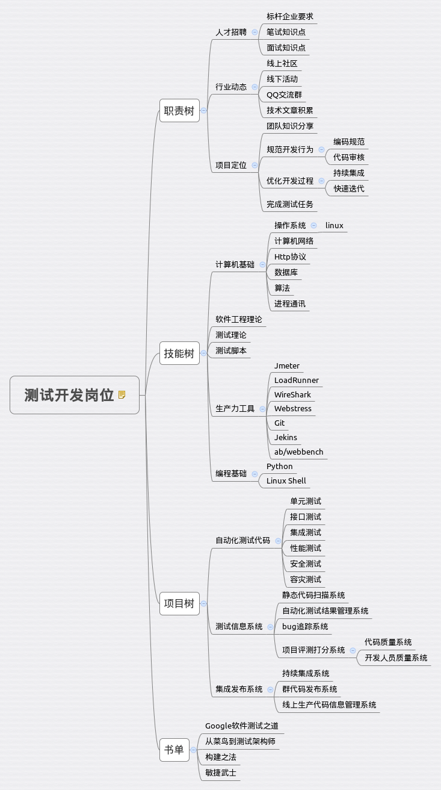

# **软件测试行业趋势分析和思考**

## 1   绪论

本文先对互联网对时代和社会变革进行了论述，然后再由互联网时代对软件工业模式变革进行了介绍，最后引出附属于软件工业的测试行业在新形势下的需求变化，并对趋势进行了分析，并最终给出了相关的从业人员的职业发展建议。

本文开题较宏大，但最后仍然会汇集到具体的测试行业的话题上来，为了避免被大家误解成“虎头蛇尾”，特做如下申明：

- 请不要认为开局话题太大，有点天马行空，不知所云。因为在社会上，小人物的命运往往是和大时代绑定在一起的，你干脆与世无争，可以什么都不用理会，但是一旦你还在追求个人的人生大理想（实现人生价值）或者仅仅是改善生活物质条件（马斯诺第一二三层次需求），就必须懂得什么叫顺势而为。可以和天斗，和地斗，和现实斗，但是不要和趋势斗。
- 请不要认为最后的落脚话题太小气，因为不管是哪个时代，社会都是由一个个鲜活的个体去实现的，而我们当中的绝大多数都属于这样的个体，穷则独善期身，达则兼济天下。作为现实生活中目前还处于小人物地位的芸芸人生的我们，还是先脚踏实地一点吧。

## 2   信息产业十年巨变

高晓松在一期《晓说》的“大航海主题”节目里面提到，他认为目前为止，他觉得 人类历史上最伟大的两项发现是：

1. 大航海时代
2. 互联网时代

两样东西都有一个共同特点，就是将这个世界抹平了，让当时的人们能够以全新的视角和思维认识这个世界。

大航海时代伴随着地理大发现，让世界的各个地方的独立孤岛融入到一个世界观中，形成了文化大碰撞，物种大交换，人类大移民。

一些主要的冲击体现在 [[1\]](http://www.cnblogs.com/beer/p/4605133.html#xiaoshuo-20140110)：

1. - 粮食物种大交换

     欧洲人从美洲引进了土豆和玉米，最低产的土豆也是最高产的小麦的18倍，而且不依赖水。，高的可以达到几百倍。极大解决了欧洲人的农业生产力问题，而且这两种作物被引入中国，促使中国在康熙年间人口终于突破了1亿，达到空前繁荣。

2. - 病毒大交流

     欧洲人给美洲带去了欧洲的疟疾，并从美洲带出了天花。导致两边的人都出现了极大的死亡率。

3. - 矿产大发现

     西班牙人在南美洲玻利维亚发现全球最大银矿，产出了40亿俩白银盛产白银，而当时的超级大国中国明朝一年的财政收集才几百万两白银。导致当年西班牙一跃成为世界最富有的国家，能够买下全世界 。购买力极强的十亿白银大量涌入中国，形成了巨大的通货膨胀，间接导致了后面的禁海和闭关锁国，以至于后面远远落后于世界化进程。

4. - 人类大移民

     最早白人集中在欧洲地区。但是大航海时代的地理大发现导致现在 美洲，非洲，大洋洲和东南亚洲到处都是欧洲白人的地盘了。

这系列的事件，影响了后面的整个世界的地理，政治和经济格局。

上面谈到的那些事件和如今和互联网时代存在太多的相似性。

每当我向别人宣扬互联网的巨大力量时，总会有人提出质疑：互联网这个东西并不像制造工业那样产生一些实际的东西，但是现在如此的热，肯定会出问题的。

我认为，互联网不产生新的实物，它就是增加效率，优化资源配置，抹平信息鸿沟，制造更平等的认知世界的机会。互联网为何这么热，原因在于我们这个社会运行的状态是很低效的，信息很不对称的，所以互联网每进入一个领域，都会带来这个领域的巨变，互联网的动作模式会把传统的动作管理模式的规则全部给颠覆，如果传统模式不做出改变，只能被狂风扫落叶的扫出历史进程了。

关于IT行业的前几十年发展史，有兴趣的可以推荐吴军博士写的《浪潮之巅》，作者以浪漫主义的笔法书写了IT行业的几十年和恩恩怨怨和浮浮沉沉· [[2\]](http://www.cnblogs.com/beer/p/4605133.html#langchaozhidian)。

下面本文将主要列举近十年（2005～2015）年来，IT行业的一些重大事件。

| [[1\]](http://www.cnblogs.com/beer/p/4605133.html#id4) | 晓说.大航海系列-黑人奴隶地位高要天价.20140110 |
| ------------------------------------------------------ | --------------------------------------------- |
|                                                        |                                               |

| [[2\]](http://www.cnblogs.com/beer/p/4605133.html#id5) | 吴军.《浪潮之巅》.2011 |
| ------------------------------------------------------ | ---------------------- |
|                                                        |                        |

### 2.1   国际状况

- 当年功能机时代的巨头 *Nokia*，2014年将设备和服务业务出售给微软，现在已轮为微软的附庸。
- 发明了第一款手机的 *Motorola*，则在这十年几易其主，先被Google收购，后来又转卖给联想。
- 当年美国可能还比较弱小的Google，如今已经成长成世界的顶级IT巨头。
- 当年IT的最红火的明星Microsoft，如今已经走下神坛，被新的明星给取代。
- Facebook在2004年由大一的毛头小伙创办，如今2015年也成IT界一极。
- 苹果公司2007年推出Iphone系列，引领移动互联网的新浪潮。
- Google在2008年发布第一款Android智能手机。如今已和苹果在移动互联网时代平分秋色，比肩而立。
- 移动互联网应用时代四处开花。各种创业公司兴趣，四处掘金。
- 互联网公司在传统行业攻城略地，打得措手不及。

### 2.2   国内状况

- 当年流行的电子通讯设备 *小灵通*，现在恐怕已无人记起。
- 当年不那么起眼的腾讯，这十年内同时在线人数突破1亿，成为通讯行业巨头。
- 微信在腾讯内部掘起，让腾讯成为首个拿到移动互联网时代船票的公司。
- 阿里上市，创造了世界上前无古人的最大IPO。也将马云送上了亚洲首富的位置。
- 小米用了4年的时间，就从零到了400亿美金市值，目前也成为中国互联网一极，而且前景无限广阔。
- 联想收购了摩托罗拉。
- 小米模式给传统的电子设备厂商打了几记响亮耳光
- 支付宝们让国有银行们开始颤抖。
- 微信们让国有通讯巨头感到危机。
- 电子盒子们让广电部门寝食难安。
- 滴滴和快滴们让国有运管部门恐慌了。
- 专业们给出租运管行业来了更彻底的革命。

生长在这个时代的年轻人，要么创造了这些历史，要么见证了这些历史，要么现在正在创造这些历史。

### 2.3   总结

前面陈述了各方面的东西，其实总结为如下几点：

1. 互联网时代是一个不可小视的时代
2. 互联网的影响才刚刚开始，但是它的影响将绝不止于当前
3. 互联网公司已经成为IT领域公司的绝对主角
4. 互联网已经从PC上转移到移动端，今后的趋势则是转化为万物互联
5. 传统行业如果不在观念和技术上紧跟上时代的步伐，只能是坐等被收割的命

## 3   软件工业模式变革

### 3.1   两种经营理念

可能不是所有的人都清楚，虽然同叫IT公司，但是IT公司还是可以分成两大类的：外包项目驱动型公司和自主产品驱动型公司。

##### 3.1.1   外包项目型

在百度百科里面对“外包”进行了如下的介绍：

> 企业在管理系统实施过程中，把那些非核心的部门或业务外包给相应的专业公司，这样能大量节省成本，有利于高效管理 [[3\]](http://www.cnblogs.com/beer/p/4605133.html#waibao-baike)。

整体来说，绝大多数的外包具有如下特点：

1. 入行门槛比较低。基本会个数据库的CRUB就可以挑起所有的信息信息项目了。
2. 技术线路短。需要会的东西杂而多，不需要精钻。
3. 开发过程要求极度规范。
4. 以项目为驱动。经常是什么来钱做什么。
5. 开发组中项目经理是灵魂人物。
6. 公司成长往往比较中规中矩，有点类似实体企业中的制造业。
7. 每个项目都是有开发周期。很多项目都是一次性项目。
8. 执行力大于创造性。给每一个客户交付他们想要的东西就算完工了。
9. 属于体力密集型，非常依靠人力，加班一般都比较严重。
10. 节奏平缓。往往可以很长时间内形成百花齐放共生的局面。
11. 从业人员的待遇，往往是和软件产出量挂钩。收入比较稳妥，但天花板也很容易触及，毕竟人的人力有限，精力有限。

这一类的传统IT公司公司目前对外包装都是“提供IT解决方案”的公司，比如：像东软，软通动力等等是比较典型的。这些公司的销售经常会在各种招投标现场看到，或者在华为公司里面有些外公司的人，很多就是这些公司派去驻场开发的，里面的员工往往会有一种“同工不同酬”的失落感。

这一类的公司，个人认为会面临逐渐被集中到少数的大集团里面，或者分散在一些兼职的个体软件工程师中。因为这项服务确实是一直被社会所需要的，社会的的更改化发展也肯定是专人做专事，外包肯定不会消亡掉。这个市场会一直存在，但是从业人员的营生类型属于赚一些辛苦钱，拼个体力而已。

| [[3\]](http://www.cnblogs.com/beer/p/4605133.html#id12) | 百度百科.“外包”词条 |
| ------------------------------------------------------- | ------------------- |
|                                                         |                     |

##### 3.1.2   自主产品型

这一类公司，大家比较熟知的主流互联网公司基本上都属于这一类型的。这一类公司具有如下特点：

1. 公司成立之初，就有自己专注的领域，而且往往是很小的一个切入点。
2. 技术线路长。像BAT，发展到如今这个体量级后，每个公司都有自己独一无二的技术高度。
3. 以产品为驱动。注重迎合客户的痛点需求。
4. 开发组中产品经理是灵魂人物。
5. 虽然也号称以项目为驱动，但是实际上将产品的不同迭代周期进行分期按项目实现。像QQ客户端从腾讯创业起到现在仍然在开发中。
6. 项目不是一次性项目，而是持续累积的项目。
7. 创造性的需求大于执行力。
8. 属于智能密集型。虽然加班也往往很严重。
9. 节奏超快。也很容易很快形成垄断局面或被完全淘汰出局。
10. 从来人员的待遇，不同水平的人差异很大。但是整体都可以有一个相对较高的水平。

目前国内这一类的主要公司有：TABLE互联网五巨头。

#### 3.2   两种生产方式

##### 3.2.1   软件工程

在传统的软件工业，软件产品以光盘为载体以类似于实物的方式进行生产和出售，软件的产出方式也是严格遵守软件工程的流程。

1. 需求分析。按照标准严格组织文档，一个长周期。
2. 系统分析。按照标准严格组织文档，一个长周期。
3. 系统设计。按照标准严格组织文档，一个长周期。
4. 系统开发。组织大量的人开始按照设计文档稳步执行和推进项目进程，一个长周期。
5. 软件测试。组织大量的人按照设计文档对功能进行测试，一个长周期。
6. 软件交付。内部测试和客户验证测试都完毕后，软件投放市场，然后运气好可以卖个好几年。
7. 再按照上面的方式花N长时间开发一下项目，或者开发下一代产品功能。

这样的的生产方式和传统的制造企业是极其类似，而且如果这种模式发展下去，肯定会越来越照搬传统制造企业的模式，因为都是需要追求流程的标准化，这样才能够保证生产和规模化和有序化。

在传统的项目驱动型的软件企业里面工作过的软件开发人员一定印象深刻：

1. 开会，沟通，评审，确认。
2. 文档，文档，文档……
3. 集中式的闭门大生产。
4. 闭关开发出符合文档的产品。

为何要这么严格的评审流程，为何要如此多的开会和文档？其实上面提到的那些行为都只是操作手段而不是目的，真正目的在于为了防止以下情况的发生：

1. - 避免甲乙双方纠纷

     从提出需求，到最后完整当初约定的功能软件，周期较长，往往存在相当多的不确定风险，对软件项目的参与者进行协议上的约束，所以需要和甲方进行沟通和文字记录，同时开发人员

2. - 减少沟通成本

     因为周期长，开发人员众多，减少沟通成本，必须要尽量多的文档。

这些都是建立在一种信息不对称，信息流通不顺畅的年代所产生的开发过程。后面将提到一种新的软件生产思路。

##### 3.2.2   敏捷开发

这是在互联网兴起之前的年代的一种软件生产思路。

主要开发流程如下

1. 确定本阶段最重要的线路目标。
2. 需求分析设计和开发。仅必要的文档，一个短周期。
3. 持续集成和持续自动化测试并发布上线。

主要的特点如下：

1. 产品的的新功能发布周期要求极短。
2. 对需求的实现及客户确认周期很短。
3. 每个短周期都有可交付的并在线上运行的版本。
4. 一个好的产品可以永远做下去。
5. 所做的内容往往具有很强的继承性的传承性。
6. 因为互联网的存在，绝大多数的问题都可以在开发场所消化解决掉。
7. 因为持续在线发布，可以时刻让实践去检验产品，直接随时和一线需求保持连接。

这种开发模式的最大特点是：快！

1. 迭代速度快。

2. 新功能发布并呈现在客户面前快。

3. 问题的发现快。

4. 问题的解决速度快。

5. - 如果方向不对，项目死掉的速度也快。

     这其实是优点，如果是坑，及时能够暴露出来也是好事

#### 3.3   个人经历及感悟

前面提到的两种公司和两种模式，目前在中国都存在相当大的市场。从个人的角度来说，更看好自主产品型的公司及开发模式。

本人第一次创业经历，就是长达两年的时间开发一个大型软件系统，最后都没有成功交付而胎死腹中。这次惨痛的经验教训，让我从此以后对外包型的创业模式深感恐惧和抵触心理。第一次创业里面做的项目，很累很累，很用心很用心，同时结局也很惨很惨。

第一次创业失败之后，又加入了现在的这个创业团队。是一种完全的互联网经营和生产模式，完全是一种久旱甘霖的畅快感。作为开发团队的一员，你的代码时刻都在生产服务器上运行着，每天开发的功能都在线上发挥着作用，你敲下的每一个字符都发挥着它的作用，而且为后面的开发在铺路。

### 4   软件测试的变革

前面花了很大的篇幅来讲大背景和大变革，现在才正式开始进入“软件测试”这个议题。个人认识还是很有必要。因为大部分开发人员都是思想和交际圈子相对比较简单的群体，打交道的对象往往是代码或者机器，往往不愿意跳出技术的思维和习惯，从更高的视角来审视自己做的事情。因为我以前就是这样的一个技术人员，往往把所有的路线选取寄托在别人身上，而且自己缺乏独立思考的能力，结果导致自己虽然很努力，但是却总是达不到自己想要的效果。

作为普通一个人，必然无法避免个体命运会随着大时代的背景进行浮沉。具备独立思考的能力相当重要，能够洞察趋势，顺势而为，必然会事半功倍。

#### 4.1   软件测试的概述

软件测试（英语：software testing），描述一种用来促进鉴定软件的正确性、完整性、安全性和质量的过程。 换句话说，软件测试是一种实际输出与预期输出间的审核或者比较过程[[4\]](http://www.cnblogs.com/beer/p/4605133.html#definition-of-soft-testing)。

不管是传统企业还是IT企业，都会有这样的一岗位，叫QC（QUALITY CONTROL的缩写，中文“质量控制”） [[5\]](http://www.cnblogs.com/beer/p/4605133.html#definition-of-qc)，专门负责品质控制的。在制造企业里面是对具体的物品进行 相应的质量检测。

不管是实物工业生产还是软件工业生产，最终的目的都是将产品交付给相应的使用人或者使用场景，使产品稳定的发挥其作用。那么既然存在交接，就必然存在验收。而关于产品的问题的发现，从生产方来说，最好是在内部就能消化和解决，而不是到投放市场之后由用户来发现，那样会对产品和企业形象都是很大的损害。所以每个企业都需要这样一个角色，用来做质量审核和把关。

在传统实物生产工业，产品质量控制主要划分为4个阶段 [[5\]](http://www.cnblogs.com/beer/p/4605133.html#definition-of-qc)：

1. 进料控制（Incoming Quality Control缩写为IQC）
2. 过程质量控制（In Process Quality Control缩写为IPQC）
3. 最终检查验证(Final Quality Control缩写为FQC)
4. 出货质量控制（Outgoing Quality Control缩写为OQC）

同样在软件工业，特别是目前外包或者众包的协作模式逐渐兴起，软件工业也逐渐像实物工业一样形成了所谓的供应链，也一样产生了如传统工业的品质控制岗位。

1. 作为甲包的验收测试
2. 本公司软件流程优化，和小版本迭代测试
3. 本公司阶段发布版测试
4. 交付下游企业的交付测试

总之，软件测试是在软件工程里面交付可靠软件的必要步骤。具体有有兴趣的可以查看软件工程相关书藉。但是查看这些的时候，请只看软件测试的定义及在软件工程中所扮演的角色部分，后面的具体操作手段可以忽略，因为随着近些年互联网和移动互联网的掘起，很多传统的软件工程组织方式和理念已经严重落伍，已经逐渐被行业给淘汰，作为软件工程中的一个环节，软件测试的手段也发生了巨大变化，这个在后面会谈到的。

| [[4\]](http://www.cnblogs.com/beer/p/4605133.html#id20) | 百度百科.'软件测试'词条 |
| ------------------------------------------------------- | ----------------------- |
|                                                         |                         |

| [5]  | *(1, 2)* 百度百科.‘QC’词条 |
| ---- | -------------------------- |
|      |                            |

#### 4.2   当前从业体验

关于从业人员的体验，以下论述事实都来自于当下热门社区“知乎”。

如何成为一个优秀的软件测试人员？ [[6\]](http://www.cnblogs.com/beer/p/4605133.html#how-to-be-better-tester)

1. 软件测试的基本原理，我称之为 测试 1.0 时代， 如 软件测试 (豆瓣)；
2. 与敏捷开发结合，我称之为 测试 2.0 时代 ， 如 敏捷软件测试 (豆瓣)；
3. Test is Dead , 测试已“死”，适应互联网新时代的要求(比如 精益创业 (豆瓣))，“不管黑猫白猫，捉到老鼠就是好猫”，当你跳出了“测试”这个圈圈，思考测试的价值了，我称之为 测试 2.5 时代 如 Google软件测试之道 (豆瓣)， 持续交付 (豆瓣)，
4. 将测试和复杂 (豆瓣)相结合，我称之为 测试 3.0 时代，但是现在的实践还比较少

QA在中国有前途么？ [[7\]](http://www.cnblogs.com/beer/p/4605133.html#qa-has-money)

文章主要观点：

1. QA是个比较有前途工作
2. 黑盒手工测试工作将逐渐被白盒和自动化代替。
3. 使用第三方自动化测试工具如QTP的测试人员，处境将比较尴尬。因为本质上只是黑盒自动化。
4. 测试工程师的趋势是和开发越来越接近。
5. 拥有代码开发能力或者数据分析能力的测试工程师才有光明前景。

| [[6\]](http://www.cnblogs.com/beer/p/4605133.html#id24) | <http://www.zhihu.com/question/20254092> |
| ------------------------------------------------------- | ---------------------------------------- |
|                                                         |                                          |

| [[7\]](http://www.cnblogs.com/beer/p/4605133.html#id25) | <http://www.zhihu.com/question/19666055> |
| ------------------------------------------------------- | ---------------------------------------- |
|                                                         |                                          |

多看一些相关话题及相关人员的回复，可以明显感受到测试岗位正在朝着”自动化，专业化和技术长线化“的方向在发展了。

#### 4.3   人才市场需求

如果说知乎上的个人的回答可能会带有浓厚的主观色彩，或者说是个人认知的局限性。那么来自人才市场的需求应该能够成为比较客观的风向标依据了吧。毕竟，规划自己的职业方向的主要目的无非是如下两点：

1. 高薪需求。自己所从事的工作的收入是可观的，这是最实在的，也是绝大多数普通人所想的。
2. 价值体现需求。一方面是社会价值体现，产生经济效益和社会效应，另外一方面是自我价值体现，实现人生满足感。这种价值体现需求会反过来影响”高薪需求“的实现。

本文通过对2015年5月份来自互联网的垂直招聘网站 *拉勾网* 的测试相关岗位的招聘要求和薪资待遇进行了研究。

关于测试岗位，工资差异很大，要求的差异也很大。

1. "北深杭"因为有TABLE这些互联网巨头存在。待遇普遍远高于其它城市。
2. 主要互联网巨头招聘测试，只招懂开发的测试。待遇和开发人员没有差异。
3. 武汉这一类二线城市，招聘测试，待遇很低（往往只有互联网巨头测试岗位的零头），要求基本上流程性文档维护和手工测试。

#### 4.4   具体需求及待遇

以”测试“为关键字进行职位搜索，发现出来的岗位待遇差异巨大，下面将针对不同的薪资结果来举例对比。

##### 4.4.1   高薪组

- - 京东

    要求熟悉测试流程和规范熟练掌握软件测试方法和常用测试工具有性能测试经验、自动化测试、安全性测试经验优先待遇10K~20K

- - 小米

    要求对大规模产品设计合适、完备的测试方案对产品质量进行控制，对产品的最终质量负责；参与通用的自动化测试平台系统的搭建；开发和维护测试和编程标准。具有3年以上性能测试经验，具有性能测试流程搭建的经验、性能指标设定、性能数据分析、性能瓶颈定位的经验者优先；精通LoadRunner，webstress，Jmeter等性能测试工具；待遇15K~30K

- - 阿里

    要求熟悉测试流程和规范熟练掌握软件测试方法一些常用测试工具熟悉Windows系列和Linux操作系统的基本操作和配置熟悉网络协议和网络环境的应用熟悉常用的自动化测试工具和Bug管理跟踪软件，版本控制软件。有性能测试经验、自动化测试、安全性测试经验优先待遇20K以上

- - 腾讯

    要求数据结构算法数据库进程通讯网络协议TCP/IP性能测试/性能优化/安全/容灾软件工程理论和测试理论基本工具使用linux/python/shellJava或C++基础wiresharkab和webbench压力工具Jmeter和loadrunner待遇10K~20K

##### 4.4.2   低薪组

- - 武汉神微资讯

    要求熟悉软件测试理论和方法；能够熟练应用多种测试工具并能按时完成软件测试工作任务；较强的英文语言表达能力和文档撰写能力；计算机及相关专业，本科及以上学历；能独立完成工作，有良好的团队合作精神；无经验可，有零售相关经验者优先待遇3K~5K

- - 软通动力

    要求有手机应用测试经验，对有android系统上的测试工作经验优先。了解测试理论和方法，熟悉软件测试流程，能够进行测试计划，测试用例，测试进度，测试报告的编写。良好的沟通能力，团队合作意识，强烈的责任心。试工作，工作细致认真，有耐心。待遇4k-6k

- - 卷皮网

    要求计算机相关专业大专及大专以上学历；能根据需求文档、设计文档编写测试计划、测试用例以及测试报告；对软件测试有浓厚的兴趣和丰富的经验，有很强的分析能力和定位问题的能力；有较强的表达和沟通能力及文档编辑能力，对细节认真思考，有相当的逻辑能力；熟悉常规测试软件（如Loadrunner，QTP等）；熟悉PHP脚本语言、Mysql数据库、服务器工作原理者更佳；熟悉Web和数据库开发技术的优先，熟悉b2c电子商务和b2c在线交易流程者优先。待遇4k-7k

##### 4.4.3   对比总结

1. 互联网巨头已经只需要高端测试人员了。
2. 高端测试人员实际上是一个懂测试的开发人员。
3. 互联网公司的低端测试工作直接外包出去。（例如腾讯的外包给了软通动力）
4. 高端和低端测试人员薪资待遇差距可以达到近十倍。

通过对更多的高端测试岗位的技能要求做总结，绘制出如下的一个技能和事务树，供大家参考：

 

## 5   最后结语

自从离开校园之后，很久没有沉下以来认真地写点东西了。主要是自己在刚跨入社会的时候，犯了一个很严重的错误，总是想用”战术的勤快来掩盖自己战略的懒惰“，一直忙低头做事，而很少停下来冷静地独立思考。还好，现在开始有这个意识，也不算太晚。

以上的内容一方面是对自己这三年思想转变和职业规划转变的总结，同时写出来，也希望能够对走在相同道路上，同样有过困惑的同行们多一点借鉴参考吧。

以上所有的结论都源于：

1. 作者个人的人生经历。
2. 所接触的视听数字消费产品。
3. 主要社交和招聘网站产生的观点或事实。
4. 看的相关专业书藉。

虽然说尽量让依据来源丰富化，但是在在选材过程中肯定难免带有一些个人主观色彩，而且作者的经历也不能代表大家的经历，所以分享此文出来，还希望此观点能够传播出去让更多的人看到，正如前端的互联网产品的开发思路”让产品尽早上线，尽早接受更多的用户考验，好坏自然分明“，所以欢迎大家来 点赞或者拍砖。

这是后续的软件测试系列的第一篇，先以概述来定基调和方向。后面将分享此基调和方向下的相关技术和手段。

 